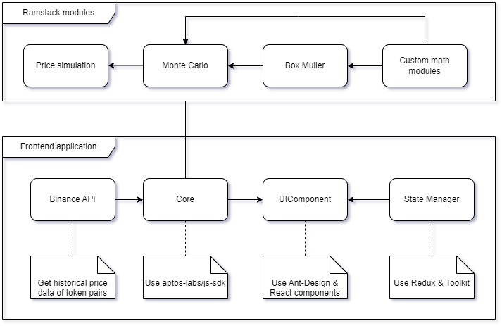

## Introduction

Ramstack implements math modules and algorithms on-chain to simulate token pair price and predict option price.

## Demo information
- [Frontend Application](https://ramstack.a2n.finance)
- [Video demo]()
- [Deployed Ramstack modules on RandomNet](https://explorer.aptoslabs.com/account/0x131af981c6ee5ee61c9440c5254f0448aef8e5cb8d2c321ff3024490c71eaaaa/modules/code/box_muller?network=randomnet)
- [Math formulas](Math.md)


For more detailed information on product features, you can refer to [our project description on TaiKai.](https://taikai.network/aptos/hackathons/aptos-random-hack/projects/cltmp232e06djwc017mvepq7j/idea)

## Key ideas
Our project employs the main idea of developing an on-chain algorithm using Monte Carlo simulation and implementing distributed computation using smart contracts to simulate the token price.

## Architecture



- We use Aptos_std and Aptos_framework as the foundation to develop Ramstack. The most important modules are fixed_point64 and math_fixed64.

- To generate random numbers following probability distributions, **we utilize the Aptos randomness API to generate uniform distribution numbers initially**. Subsequently, math formulas such as Box-Muller and inverse CDF are applied to transform these numbers.

- For frontend development, we employ Aptos-labs/ts-sdk, Next.js, Redux Toolkit, Rechart, and Ant Design.

## Ramstack modules

- [PI](contracts/ramstack/sources/pi.move): Approximate the value of π using the Bailey-Borwein-Plouffe and Leibniz formulas.
- [Cosine and Sine](contracts/ramstack/sources/cos_sin.move): Approximate Cos(x) and Sin(x) using the Maclaurin series formula, where x is in radians.
- [Fixed Point64 with Sign](contracts/ramstack/sources/fixed_point64_with_sign.move): Enhance the original fixed_point64 module in the aptos_std package to support both positive and negative numbers.
- [Math Fixed64 with Sign](contracts/ramstack/sources/math_fixed64_with_sign.move): Enhance the original math_fixed64 module in the aptos_std package to allow operations such as multiplication, division, natural logarithm, mean, standard variation, minimum, maximum, and square root using fixed_point64_with_sign. This enables operations on both negative and positive numbers.

- [Box-Muller](contracts/ramstack/sources/box_muller.move): Transform random numbers of uniform distribution (generated from Randomness) to normal distribution using the Box-Muller method.
- [Chi-square Transform](contracts/ramstack/sources/chisquare_transform.move): Transform random numbers of uniform distribution to Chi-square distribution. (uniform -> normal -> Chi-square)
- [Laplacian Transform](contracts/ramstack/sources/laplacian_transform.move): Transform random numbers of uniform distribution to Laplacian distribution using the inverse CDF.
- [Exponential Transform](contracts/ramstack/sources/exponential.move): Transform random numbers of uniform distribution to Exponential distribution using the inverse CDF.

- [Prob_distribution](contracts/ramstack/sources/prob_distribution.move): Include view functions to generate random numbers based on inputs and specific distributions.

- [Price_simulation](contracts/ramstack/sources/price_simulation.move): Include view functions to generate price paths based on inputs and the Monte Carlo algorithm.


## Installation

To build & test smart contract:
- Go to smart contract folder, e.g. ```cd contracts/ramstack```
- To compile: ```aptos move compile ```
- To test: ```aptos move test```


To run Ramstack frontend application:
- ```cd frontend```
- ```npm i```
- ```npm run dev``` for the dev mode
- ```npm run build``` & ```npm run start``` for the production mode.


